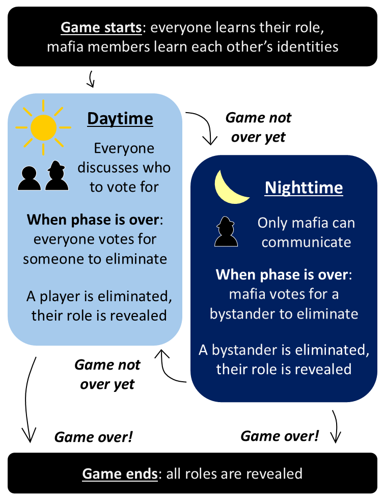

# LLMafia - Asynchronous LLM Agent

Our Mafia games dataset and code, of an **Asynchronous LLM Agent** playing games of *Mafia* with multiple human players.

Check out our (preprint) paper "Time to Talk": https://arxiv.org/abs/2506.05309 


*A virtual game of Mafia, played by human players and an LLM agent player. The agent integrates in the asynchronous group conversation by constantly simulating the decision to send a message.*
___

> **Time to Talk: 🕵️‍♂️ LLM Agents for Asynchronous Group Communication in Mafia Games**<br>
> Niv Eckhaus, Uri Berger, Gabriel Stanovsky<br>
> <a href="https://arxiv.org/abs/2506.05309" target="_blank">https://arxiv.org/abs/2506.05309<br>
>
>**Abstract:** LLMs are used predominantly in *synchronous* communication, where a human user and a model communicate in alternating turns. In contrast, many real-world settings are inherently *asynchronous*. For example, in group chats, online team meetings, or social games, there is no inherent notion of turns; therefore, the decision of *when* to speak forms a crucial part of the participant's decision making. In this work, we develop an adaptive asynchronous LLM-agent which, in addition to determining *what to say*, also decides *when to say it*. To evaluate our agent, we collect a unique dataset of online Mafia games, including both human participants, as well as our asynchronous agent. Overall, our agent performs on par with human players, both in game performance, as well as in its ability to blend in with the other human players. Our analysis shows that the agent's behavior in deciding when to speak closely mirrors human patterns, although differences emerge in message content. We release all our data and code to support and encourage further research for more realistic asynchronous communication between LLM agents. This work paves the way for integration of LLMs into realistic human group settings, from assistance in team discussions to educational and professional environments where complex social dynamics must be navigated.

In our paper we propose an agent designed for asynchronous conversations. Our agent consists of two modules: the *scheduler*, deciding whether to post a message to the chat at a given moment, and the *generator*, which composes the message content.

## Asynchronous Agent


*Schematic display of the agent's logic design. A detailed overview of the agent's structure can be found in our paper.*

## The Game of Mafia



We choose to set our evaluation of asynchrony modeling for LLMs in a game setting.

Games give each participant an objective. Winning the game is a proxy metric of whether the communication was successful. It sets the conversation under a frame of rules, where each participant needs to use the communication to advance to their target.

We choose *Mafia*, a social deduction game in which each player is secretly assigned a role, either *mafia* or *bystander*. Only mafia players are aware of all players' roles. Every round starts with a daytime phase, where all players discuss who they think the mafia players might be, and vote out one player. Then the game moves to a nighttime phase, where only mafia players interact and vote to decide which bystander they want to eliminate. In the next round's daytime, the mafia's victim is revealed. The game continues until one of the teams achieves their objective: the mafia's goal is to outnumber the bystanders, and the bystanders' goal is to vote out all mafia.

We choose the game of Mafia for evaluating our several reasons. First, it can be based solely on textual interaction, which allows LLMs to play together with human players. Second, it requires collaboration under uncertainty, making communication between participants a fundamental aspect of the game. Third, it centers around suspicion of other players, so both extreme strategies of constantly speaking or not speaking at all can be seen as suspicious. Therefore, the timing of communication is crucial for the player's success.


## LLMafia Dataset

The collected data of games is available under the `games` directory.
Each game subdirectory contains files with the messages sent by all players, human and LLM, in addition to game-management messages, metadata, results and each game's configuration (after being anonymized).

Analysis of the dataset is described thoroughly in our paper, with a focus on our LLM agent performance in the game from different perspectives.


## Citation
If you find this useful for your research, please use the following:

```
@misc{eckhaus2025timetalkllmagents,
      title={Time to Talk: LLM Agents for Asynchronous Group Communication in Mafia Games}, 
      author={Niv Eckhaus and Uri Berger and Gabriel Stanovsky},
      year={2025},
      eprint={2506.05309},
      archivePrefix={arXiv},
      primaryClass={cs.MA},
      url={https://arxiv.org/abs/2506.05309}, 
}
```

## Contact

For any enquiry you can contact us at: niv.eckhaus@mail.huji.ac.il
